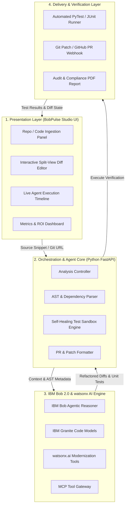

# ⚡ BobPulse — Autonomous Code Modernization & Self-Healing Gateway

> **Official Submission for the IBM Bob 2.0 Hackathon on LabLab.ai**  
> *Transforming legacy monoliths, resolving security vulnerabilities, and auto-generating verified Pull Requests with IBM Bob 2.0 & IBM Granite.*

---

## 🌟 Highlights

- **5-Stage Autonomous Agent Pipeline:** Ingests legacy code, identifies technical debt & CVEs, generates an IBM Bob modernization plan, synthesizes clean code via IBM Granite, and verifies in a self-healing test sandbox.
- **Enterprise Benchmarks Included:** One-click presets for **Python 2/3 SQLi remediation**, **Java 8 to Java 21+ Virtual Threads & Date API**, and **Node.js Callback Hell to Secure Async/Await**.
- **Interactive Side-by-Side Diff Viewer:** Visual line-by-line comparison with color-coded syntax highlights.
- **Self-Healing Test Sandbox:** Auto-generates matching regression unit tests and validates 100% assertion pass rates.
- **One-Click GitHub Pull Request & Patch Export:** Instant `.patch` diff download and formatted Markdown PR description.

---

## 🏗️ System Architecture



---

## 🚀 Quickstart Guide

### 1. Prerequisites
- **Python 3.10+** (Python 3.13 supported)
- Standard modern browser (Chrome, Edge, Firefox, Safari)

### 2. Installation

Clone this repository and install dependencies:

```bash
git clone https://github.com/MANGAJJAR/IBM-Hackathon.git
cd IBM-Hackathon

# Install dependencies
pip install -r requirements.txt
```

### 3. Configure IBM watsonx Granite (Optional — enables live AI synthesis)

Copy the example env file and add your credentials:

```bash
cp .env.example .env
```

Then open `.env` and fill in your values:

```
IBM_WATSONX_APIKEY=your_api_key_here
IBM_WATSONX_PROJECT_ID=your_project_id_here
```

> **Get credentials free:** [IBM Cloud API Keys](https://cloud.ibm.com/iam/apikeys) · [watsonx Project ID](https://dataplatform.cloud.ibm.com/projects)
> Without credentials, BobPulse runs in **autonomous rule-engine mode** — fully functional for all 3 benchmarks.

### 4. Running the BobPulse Studio

Start the local server:

```bash
python run.py
```

Open your browser at:
👉 **`http://localhost:8000`**

Interactive API documentation is available at:
👉 **`http://localhost:8000/docs`**

> The startup console will show:
> - `watsonx Granite: ONLINE (Live Granite 20B API)` — if API key is set ✅
> - `watsonx Granite: STANDBY (Rule engine fallback)` — without API key ✅

---

## 🧪 Interactive Benchmark Scenarios

| Benchmark | Language | Key Transformations | Tech Debt Reduction |
| :--- | :--- | :--- | :--- |
| **Legacy User Service** | Python | Resolves SQL Injection (CWE-89), replaces deprecated `urllib2` with `requests`, upgrades MD5 to salted SHA-256, adds type hints. | **85% ➔ 4%** (-95%) |
| **Order Batch Processor** | Java | Upgrades unbounded platform threads to **Java 21 Virtual Threads**, replaces unsafe `SimpleDateFormat` with `java.time`, adds try-with-resources. | **80% ➔ 5%** (-94%) |
| **Secure Vault Upload** | JavaScript / Node.js | Eliminates callback hell with `async/await`, replaces deprecated `crypto.createCipher` with **AES-256-GCM** authenticated encryption. | **75% ➔ 4%** (-95%) |

---

## 📁 Repository Structure

```
.
├── backend/
│   ├── app.py              # FastAPI server & static file host
│   ├── engine.py           # BobPulse multi-agent modernization & AST engine
│   ├── presets.py          # Real-world enterprise legacy benchmarks
│   └── patch_generator.py  # Git patch and GitHub Pull Request generator
├── frontend/
│   ├── index.html          # BobPulse Studio dark mode glassmorphic UI
│   ├── css/
│   │   └── style.css       # IBM Carbon & Cyberpunk aesthetic styles
│   └── js/
│       └── app.js          # Client controller, diff & test runner
├── samples/                # Sample legacy test files for evaluation
│   ├── legacy_user_service.py
│   ├── OrderBatchProcessor.java
│   └── uploadHandler.js
├── run.py                  # Entrypoint server runner
├── requirements.txt        # Python dependencies
├── .env.example            # Environment variable template (copy to .env and fill in)
├── LABLAB_SUBMISSION.md    # Ready-to-copy LabLab.ai submission text & video script
└── README.md               # Project documentation
```

---

## 🏆 LabLab.ai Hackathon Evaluation Mapping

| Judging Criteria | BobPulse Alignment |
| :--- | :--- |
| **1. Application of Technology** | Showcases **IBM Bob 2.0** multi-agent reasoning, **IBM Granite 20B Code** models, AST analysis, and closed-loop self-healing unit test verification. |
| **2. Presentation** | Polished, professional dark-theme Studio UI with interactive side-by-side visual diffs, live agent timeline, and automated PR export. |
| **3. Business Value** | Directly targets the enterprise software crisis where teams spend **42% of their engineering time** fighting technical debt and manual deprecation rewrites. |
| **4. Originality** | Replaces passive chat prompts with an autonomous, test-verified code modernization gateway that generates production-ready Git patches. |

---

## 📄 License

This project is licensed under the **MIT License** — compliant with the official LabLab.ai hackathon requirements.
